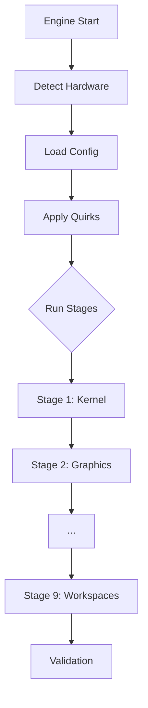

# Strix Halo Post-Installer Architecture

## 1. Overview

The Strix Halo Post-Installer is a **unified Go binary** designed to configure CachyOS on AMD Strix Halo (gfx1151) hardware. It provides a seamless user experience that gracefully degrades from a rich GUI to a robust TUI depending on the environment.

**Key Features:**
- **Single Binary**: One executable (`strix-install`) contains both GUI and TUI logic.
- **Adaptive UI**: Automatically selects the best available interface (Native Window → Browser → Terminal).
- **State Management**: Tracks validation, checkpoints, and provides rollback capabilities.

---

## 2. Directory Structure

```
strix-install/
├── cmd/
│   └── install/              # Unified entry point (bootstraps UI selection)
├── pkg/
│   ├── core/                 # Engine, EventBus, StateManager
│   ├── platform/             # Hardware abstraction layer
│   │   └── strixhalo/        # Main implementation
│   │       ├── devices/      # Quirk definitions (Beelink, Framework)
│   │       └── stages/       # Logic for Kernel, GPU, LXD, etc.
│   ├── system/               # OS adapters (Pacman, LXD, Systemd)
│   └── ui/                   # Interface abstractions (TUI + Web impl)
├── configs/                  # YAML definitions for platforms/devices
├── docs/                     # Documentation
└── install.sh                # Bootstrap downloader
```

---

## 3. Core Engine

### The Stage Pipeline
The installer runs a sequence of **Stages**. Each stage implements:

- **Run()**: The main logic (idempotent where possible).
- **Validate()**: Checks if the stage was successful.
- **Rollback()**: Reverts changes if failure occurs (best effort).



### Event System
The engine emits events (`Progress`, `Log`, `Prompt`) which are consumed by the UI layer. This allows the core logic to be decoupled from the display.

---

## 4. Unified UI Strategy

The `strix-install` binary follows this initialization logic:

1.  **Check for `--tui` / `--web` flags**: User override takes priority.
2.  **Try Native Window** (WebView2/WebKit):
    - Uses Wails to spawn a native window.
    - Provides a standard desktop installer experience.
3.  **Fallback to Browser Popup**:
    - If native window fails (e.g., missing libs), starts a local web server (localhost:8080).
    - Opens system browser in "app mode" (hidden address bar/menus).
4.  **Fallback to Terminal UI**:
    - If no graphical environment detected (SSH, TTY), launches Bubble Tea TUI.

---

## 5. Technology Stack

| Component | Technology | Reasoning |
|-----------|------------|-----------|
| **Language** | Go 1.23+ | Static binary, cross-compilation, strong concurrency. |
| **GUI** | Wails (WebView2/WebKit) | Native look and feel, uses existing system webview. |
| **TUI** | Bubble Tea | Modern, interactive terminal UI. |
| **Config** | YAML | Human-readable configuration. |
| **Container** | LXD | Native Linux containers, good GPU passthrough. |
| **System** | Systemd, Pacman | Native integration with CachyOS/Arch. |

---

## 6. Stages (Detailed)

| Stage | ID | Actions |
|-------|----|---------|
| **1. Kernel** | `kernel` | Backs up GRUB, enforces kernel 6.18+, applies `iommu=pt`, blacklists `ice` (Beelink). |
| **2. Graphics** | `graphics` | Installs Mesa 25.3+, LLVM 21.x, Vulkan. Ensures firmware is latest. |
| **3. System** | `system` | Optimizes mirrors (`rate-mirrors`), runs `pacman -Syu`, installs essentials (`base-devel`, `git`). |
| **4. LXD** | `lxd` | Installs LXD, inits storage/network, creates default profile with GPU passthrough. |
| **5. Thermal** | `thermal` | Installs `lm_sensors`, failsafe `fancontrol` config for Strix Halo. |
| **6. Cleanup** | `cleanup` | Removes orphans, clears package cache. |
| **7. Validation** | `validate` | verify: `glxinfo` (RADV), `vulkaninfo`, `lxc list`, kernel params. |
| **8. Apps** | `apps` | Optional: Firefox, Signal, VLC, LibreOffice/OnlyOffice. |
| **9. Workspaces** | `workspace` | Optional: Creates `ai-lab` (ROCm/PyTorch) and `dev-lab` containers. |

---

## 7. Device Detection & Quirks

The installer uses DMI data to identify hardware and apply specific "Quirks".

| Device | Quirk ID | Action |
|--------|----------|--------|
| **Beelink GTR9** | `e610-blacklist` | Adds `modprobe.blacklist=ice` to kernel args to prevent crashes. |
| | `tdp-tool` | Installs `ryzenadj` for power control. |
| **Framework** | `fan-noise` | (Advisory) Recommends "Balanced" power profile. |
| **Minisforum S1** | `usb4-unstable` | (Advisory) Warns about rear USB4 stability on Linux. |
| **Generic** | - | Applies standard Strix Halo optimizations. |

---

## 8. Build Outputs

| Binary | Size | Use Case |
|--------|------|----------|
| `strix-install` | ~20 MB | Unified Binary (TUI + GUI) |

Build command:
```bash
# Builds single binary with both TUI and Wails/Web assets
go build -tags desktop,tui -o strix-install ./cmd/install
```

---

## 9. Extensibility mechanism

To add support for a new distro (e.g., Fedora):
1.  Implement `pkg/system/PackageManager` interface (dnf vs pacman).
2.  Create `configs/fedora.yaml`.
3.  The core engine remains unchanged.
