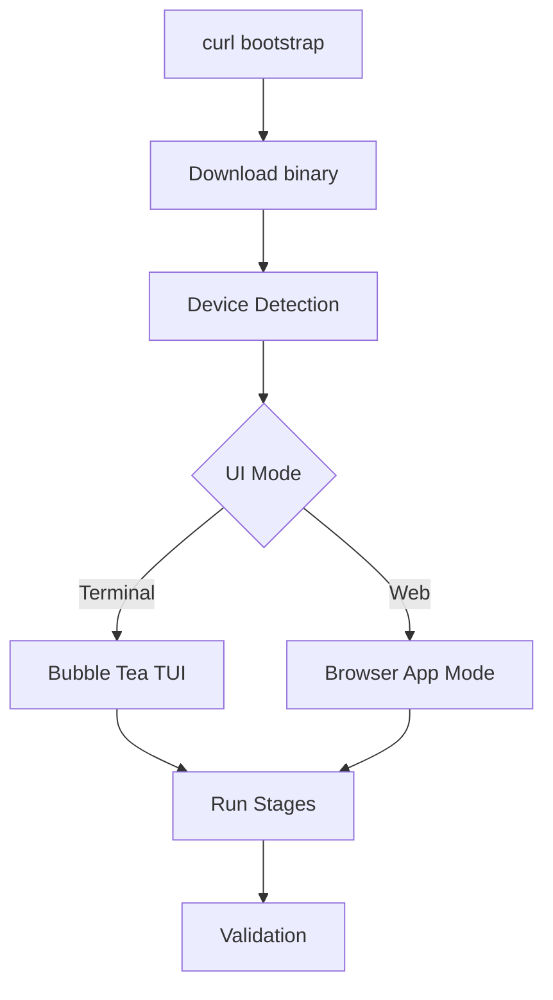

# Installation Architecture

## Overview

The Strix Halo Post-Installer is a **Go-based binary** that configures CachyOS systems for AMD Strix Halo (gfx1151) hardware. It provides both a TUI (terminal) and Web UI interface.

## Components

```
strix-halo-setup/
├── strix-installer/          # Go source code
│   ├── cmd/tui/              # Unified entry point (TUI + Web)
│   └── pkg/
│       ├── core/             # Engine, stages, events
│       ├── platform/         # Strix Halo specific implementation
│       └── system/           # OS interaction (pacman, lxd, etc.)
├── stages/                   # Legacy shell scripts (reference)
├── docs/                     # Documentation
└── install.sh                # Bootstrap script for short URL
```

## Installation Flow



## Stages

| Stage | Purpose |
|-------|---------|
| 1. Kernel Config | IOMMU, GRUB parameters, device quirks |
| 2. Graphics Stack | Mesa 25.3+, LLVM 21.x, Vulkan |
| 3. System Update | Mirror ranking, package updates |
| 4. LXD Setup | Container service, GPU passthrough |
| 5. Thermal Control | lm_sensors, fancontrol (optional) |
| 6. Cleanup | Orphan packages, cache cleanup |
| 7. Validation | Verify kernel, GPU, LXD |
| 8. Desktop Apps | Browsers, Office (optional) |
| 9. Workspaces | ai-lab, dev-lab containers (optional) |

## Device Detection

The installer automatically detects hardware and applies device-specific quirks:

| Device | Detection | Quirk |
|--------|-----------|-------|
| Beelink GTR9 Pro | DMI match | E610 Ethernet blacklist |
| Framework Desktop | DMI match | No quirks needed |
| Minisforum S1 Max | DMI match | USB4/Ethernet advisory |
| Generic | Fallback | Standard configuration |

## Technology Stack

| Component | Technology |
|-----------|------------|
| Language | Go 1.23+ |
| TUI | Bubble Tea + Bubbles + Lipgloss |
| Web | Embedded HTML/CSS/JS |
| Config | YAML |
| Packages | pacman, yay (AUR) |
| Containers | LXD |

## Version Requirements (January 2026)

| Component | Required |
|-----------|----------|
| Kernel | **6.18+** |
| Mesa | **25.3+** |
| ROCm | **7.2+** |
| LLVM | **21.x** |

## Why CachyOS?

- **Optimized kernels**: Pre-built for Zen 5 architecture
- **Fast repos**: Packages built with `-march=native`
- **Recent packages**: Arch-based, latest Mesa/kernel
- **Performance**: Better out-of-box for modern AMD hardware
