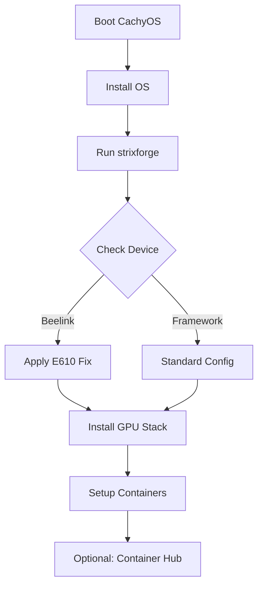

# CachyOS Installation Guide for Strix Halo

**Version**: 2026.01.09 | **Author**: Dave Weinstein

**StrixForge** is the definitive tool for forging a workstation-class Linux experience on Strix Halo hardware. This guide covers installing CachyOS and running the post-install configuration scripts. Please check the **Hardware Compatibility Matrix** below before beginning.

> [!CAUTION]
> **Beelink GTR9 Pro Notice:** The Intel E610 10GbE chip causes kernel panics on Linux 6.12+. You MUST disable "Device 3 Fun 2" in BIOS or blacklist the `ice` driver.
>
> **Note to Beelink:** We bought and returned a GTR9 Pro due to the E610 problems (thanks for being cool about that). We'd be happy to add support for version 2 hardware when you're ready. If you want us to do so please reach out to us for validation.

> [!TIP]
> **Framework Desktop:** No known significant issues.
>
> **Our Setup:** Our current test machine uses a Framework 128GB motherboard (but isn't in the Framework case).
> **To Framework:** If you'd like us to verify the 32GB or 64GB versions (or a clustering setup like we've seen on several influencer channels) please reach out to us.

> [!NOTE]
> **Minisforum Notice:** The MS-S1 MAX is shipping but requires kernel tweaks for USB4 stability. We have not tested this unit. The N5 MAX was announced at CES2026, and is yet to ship.

If you're a manufacturer that isn't listed, please don't take it personally, check to see if you're listed in Appendix A, and please reach out to us so we can add support for your devices.

## Part 1: CachyOS Installation

### Requirements

*   USB drive (16GB+)
*   Strix Halo hardware
*   Active Internet connection

### Step 1: Create Bootable USB

> [!NOTE]
> **Option A: Ventoy (Recommended)**
> 1. Download [Ventoy](https://www.ventoy.net/en/download.html)
> 2. Install to USB drive
> 3. Copy the [CachyOS ISO](https://cachyos.org/download/) directly to the USB drive partition

### Step 2: BIOS Configuration

**Global Defaults (All Devices):**

| Setting | Value | Reason |
| :--- | :--- | :--- |
| Secure Boot | **Disabled** | Required for CachyOS/Arch kernel modules |
| Boot Mode | **UEFI** | Legacy/CSM not supported |
| IOMMU | **Enabled** | Required for virtualization/containers |
| SVM Mode | **Enabled** | Required for virtualization |

### Hardware Compatibility Matrix

Apply these settings based on your specific device **before** proceeding to Step 3.

| Vendor / Model | BIOS Action | Kernel Parameter (GRUB) | Known Issues |
| :--- | :--- | :--- | :--- |
| **Framework**<br>Mainboard | VRAM: Auto | *None* | High fan noise in "Performance" mode. |
| **Beelink**<br>GTR9 Pro | **DISABLE** PCIe Dev 3 Fun 2 | `module_blacklist=ice` | **CRITICAL:** 10GbE Driver Crash. |
| **Minisforum**<br>MS-S1 Max | Default | `pcie_port_pm=off` | Rear USB4 stability fix. |

> [!CAUTION]
> **CRITICAL BEELINK BIOS INSTRUCTIONS**
> To prevent random crashes on the Beelink GTR9 Pro, navigate to:
> `Advanced` → `Demo Board` → `PCI-E Port` → `Device 3 Fun 2` → **Disabled**

### Step 3: Install CachyOS

1.  Boot from USB
2.  Run Calamares installer (This will wipe the factory Windows 11 OS)
3.  **Partitioning:** Select BTRFS (critical for snapshots)
4.  **Swap:** Create swap partition (recommended: 32GB+)
5.  Complete install & Reboot

## Part 2: Post-Install Configuration

### Quick Install

**Option 1: Short URL (via Bootstrap)**

```bash
curl -fsSL https://bit.ly/strixforge | sudo bash
```

*This fetches `install.sh` from GitHub, which downloads the binary release to `/tmp` and executes it. For a deep dive on exactly how this script works and the architecture behind it, please read the [README on GitHub](https://github.com/daveweinstein1/strixforge).*

**Option 2: Direct Binary Download**

```bash
curl -fsSL https://github.com/daveweinstein1/strixforge/releases/latest/download/strixforge -o /tmp/s && chmod +x /tmp/s && sudo /tmp/s
```

### Installer Options

| Flag | Description |
| :--- | :--- |
| `(none)` | Auto-detects best UI (Web → TUI) |
| `--tui` | Forces Terminal UI |
| `--gui` | Forces Graphical UI |
| `--auto` | Runs all stages without prompts |
| `--manual` | Interactive stage selection |
| `--hub` | Browse and install community containers |
| `--check-versions` | Verify package versions and exit |
| `--dry-run` | Simulate installation without changes |

### Container Hub

The installer includes a graphical browser for community-maintained container images optimized for Strix Halo. Launch the hub to explore available toolboxes:

```bash
strixforge --hub
```

| Source | Description | Example Images |
| :--- | :--- | :--- |
| **kyuz0** | Community Strix Halo toolboxes | rocm-7rc, llama-vulkan, pytorch-2.5 |
| **AMD Official** | AMD-maintained AI containers | comfyui-rocm |
| **Community** | Verified community contributions | (Varies — see hub) |

> [!NOTE]
> **Usage:** Select an image from the hub and install it into an existing LXD container (e.g., `ai-lab` or `dev-lab`). The installer will execute `lxc exec <container> -- toolbox create <name> --image <url>` for you.

### What Gets Configured

| Stage | Actions Taken |
| :--- | :--- |
| **1. Kernel** | Adds `amd_iommu=on`, `iommu=pt`. Applies vendor-specific patches from Hardware Matrix. Blacklists `ice` driver on Beelink. |
| **2. Graphics** | Installs Mesa 25.3+, Vulkan, LLVM 21. Configures RADV. |
| **3. System** | Updates mirrors, installs `base-devel`, `git`, `btop`. |
| **4. LXD** | Installs LXD, configures current user, enables GPU passthrough. |
| **5. Thermal** | Installs `lm_sensors`, `fancontrol`. Runs sensor detection. **Disables ZRAM** on systems with ≥64GB RAM to prevent GTT memory conflicts. |
| **6. Cleanup** | Removes orphans, clears distinct package caches. |
| **7. Validate** | Checks `glxinfo`, `vulkaninfo`, container health. |
| **8. Apps** | Optional: Firefox, VLC, Signal, coding tools. |
| **9. Workspaces** | Optional: Creates `ai-lab` (ROCm) and `dev-lab` containers. |

## Package Inventory

This is the software stack I personally use. If you need different IDEs or office tools, please install them manually. The "Extra Browsers" are included to make it easy to maintain separate "Logged In" states.

### Graphics Stack (Stage 2)

| Package | Version | Description |
| :--- | :--- | :--- |
| `mesa` | 25.3.0 | Open-source OpenGL/Vulkan for AMD |
| `lib32-mesa` | 25.3.0 | 32-bit libs for Wine/Gaming |
| `mesa-utils` | 9.0.0 | Mesa utilities (glxinfo) |
| `vulkan-radeon` | 25.3.0 | Vulkan driver for RDNA3 |
| `lib32-vulkan-radeon` | 25.3.0 | 32-bit Vulkan driver |
| `vulkan-tools` | 1.3.290 | Vulkan utilities (vulkaninfo) |
| `linux-firmware` | 20250108 | Firmware files for AMD GPUs |
| `llvm` | 21.0.0 | Compiler infrastructure for Mesa |
| `lib32-llvm` | 21.0.0 | 32-bit LLVM libraries |

### System Essentials (Stage 3)

| Package | Description |
| :--- | :--- |
| `base-devel` | Build tools (gcc, make) |
| `git` | Version control |
| `wget` / `curl` | Network downloaders |
| `vim` / `neovim` | Text editors |
| `btop` | Resource monitor |
| `fastfetch` | System info tool |

### Containerization (Stage 4)

| Package | Version | Description |
| :--- | :--- | :--- |
| `lxd` | 6.2 | System container and VM manager |

### Fan & Thermal Control (Stage 5)

| Package | Description |
| :--- | :--- |
| `lm_sensors` | Hardware monitoring tools |
| `fancontrol` | Fan speed control daemon |

### Desktop Applications (Stage 7) — Optional

| Package | Source | Why include it? |
| :--- | :--- | :--- |
| `firefox` | Extra | Primary privacy-focused browser. |
| `google-chrome` | AUR | Standard web testing. |
| `ungoogled-chromium` | AUR | **Dev Tool:** Useful for testing apps without Google services tracking. |
| `helium` | AUR | **Dev Tool:** Minimal browser for quick lookups. |
| `onlyoffice-bin` | AUR | Microsoft Office compatible suite. |
| `signal-desktop` | Extra | Encrypted messaging. |
| `vlc` | Extra | Media player. |
| `yay` | AUR Helper | Community package installer. |

> [!NOTE]
> **Why so many browsers?**
> We include standard Chrome, Ungoogled Chromium, and Helium to allow developers to maintain distinct "logged-in" states (e.g., Personal, Work, Testing) simultaneously. This prevents the friction of constantly logging in and out when debugging web applications that require authentication.

### LXD Containers (Stage 8) — Optional

> [!NOTE]
> **Why Containers?** These isolate your development environments from your stable OS. If you break an AI library in `ai-lab`, your main system remains clean.

#### ai-lab (ROCm AI Workloads)

| Package | Description |
| :--- | :--- |
| `rocm-hip-sdk` | AMD ROCm HIP SDK 7.2.0 |
| `python-pytorch-rocm` | PyTorch 2.5.1 with ROCm backend |
| `python-numpy` | Numerical computing |
| `python-pip` | Python package installer |
| `ollama` | Local LLM runner (Llama, Mistral) |
| `ComfyUI` | Stable Diffusion UI (via git clone) |

#### dev-lab (General Coding)

| Package | Description |
| :--- | :--- |
| `rust` / `go` | Language compilers |
| `nodejs` / `npm` | JS Runtime (v23.5.0) |
| `python` | Python 3.13.1 |
| `base-devel` | Build tools |

### Package Dependencies

```
Graphics Stack
├── mesa ← requires llvm
├── vulkan-radeon ← requires mesa
└── lib32-* packages ← require 32-bit base libraries

Containers
├── lxd ← requires lxd group membership
└── GPU passthrough ← requires graphics stack

AUR Packages
└── all ← require yay (or another AUR helper)

ROCm/AI
├── rocm-hip-sdk ← requires kernel 6.18+ with AMDGPU
└── python-pytorch-rocm ← requires rocm-hip-sdk
```

## Troubleshooting

### Connectivity

**Ethernet keeps dropping (Beelink)**
This is the E610 driver bug.
*   **Fix:** Check BIOS settings (see Step 2). Ensure installer Stage 1 ran (blacklists `ice`).
*   **Workaround:** Use Wi-Fi or USB-C Ethernet dongle.

**Wi-Fi slow/unstable**
*   **Fix:** Disable power saving: `sudo iw dev wlan0 set power_save off`

### Graphics / Display

**Black screen on boot**
*   **Fix:** Add `nomodeset` to kernel params in GRUB. Then run installer Stage 2.

**Stuttering / Glitches**
*   **Fix:** Ensure `xf86-video-amdgpu` is installed. Check `dmesg | grep amdgpu` for firmware errors.
*   **Ref:** [Arch Wiki - AMDGPU](https://wiki.archlinux.org/title/AMDGPU#Troubleshooting)

### Virtualization

**LXD "Permission Denied"**
*   **Fix:** Log out and back in. Group membership (`lxd`) applies on next login.

**VMs/Containers slow**
*   **Fix:** Verify SVM is enabled in BIOS: `dmesg | grep -i svm` should show "SVM enabled".

### AI / ROCm

**"HIP device not found"**
*   **Fix:** The user likely needs to be added to the `video` and `render` groups. Run this command:
    ```bash
    sudo usermod -aG video,render $USER && echo "Please reboot for group changes to take effect."
    ```
*   **Fix 2:** Ensure `hsa-amd-aqlprofile-bin` is installed (handled by installer).

___

## Technical Architecture

For a deep dive on how the installer works, stage dependencies, and deployment flow, see the [Architecture Document](ARCHITECTURE.md).



___

## Appendix A: Complete Hardware Ecosystem

> [!NOTE]
> **To Hardware Manufacturers:**
> We are actively developing the Linux support layer for this platform. If you have current or unreleased hardware you would like supported/validated, please contact us via our GitHub Repository (open an Issue titled "Vendor Outreach"). If your device is missing from this list (updated Jan 2026), please let us know so we can add it.

Comprehensive list of known Strix Halo devices as of January 2026. **Note:** All devices use soldered LPDDR5X memory.

| Vendor | Models & Form Factors | Specs (CPU \| Memory) | Availability | Shipped OS | Known Issues / Quirks | In Contact? |
| :--- | :--- | :--- | :--- | :--- | :--- | :--- |
| **Framework** | **Framework Desktop** (SFF Mainboard) | Max+ 395 \| 32/64/128GB | **Backorder** (Batch 17) | **DIY (No OS)** | Thermal throttling in laptop chassis (Desktop recommended) | **No**<br><span style="font-size: 0.85em;">We have one</span> |
| **Minisforum** | **MS-S1 MAX** (Mini Workstation)<br>**N5 MAX** (NAS 5-Bay) | **S1:** Max+ 395 \| 32/64/96/128GB<br>**N5:** Max+ 395 \| 32/64/128GB | **S1:** **Shipping**<br>**N5:** Announced | **Win 11** | **S1:** Rear USB4 requires kernel fix; OCuLink finicky<br>**N5:** | **No** |
| **Beelink** | **GTR9 Pro** (Mini PC) | Max+ 395 \| 32/64/128GB | **Preorder** (Mid-Jan) | **Win 11** | **Critical:** Intel E610 10GbE crashes system on Linux | **No** |
| **HP** | **ZBook Ultra 14 G1a** (Laptop 14")<br>**Z2 Mini G1a** (Mini PC) | **ZBook:** Max+ 395 \| 32/64/96/128GB<br>**Z2 Mini:** Max+ 395 \| 32/64/96/128GB | **ZBook:** **Shipping**<br>**Z2 Mini:** Shipping | **Win 11 / Ubuntu 24.04** | | **No** |
| **ASUS** | **ProArt PX13** (Laptop 13")<br>**TUF Gaming A14** (Laptop 14") | **PX13:** Max+ 395 \| 32/64GB<br>**A14:** Max+ 392 \| 16/32/64GB | **PX13:** Announced<br>**A14:** Announced | **Win 11** | | **No** |
| **Abee** | **AI Station** (Mini PC) | Max+ 395 \| Up to 128GB | **Announced** | **Win 11** | **Liquid Cooled;** Internal 400W PSU | **No** |
| **NIMO** | **AI Mini PC** | Max+ 395 \| 128GB | **Announced** | **Win 11** | | **No** |
| **FAVM** | **FA-EX9** (Mini PC) | Max+ 395 \| 128GB | **Shipping** | **Win 11** | Features OCuLink | **No** |
| **MINIX** | **Elite ER939-AI** (Mini PC) | Max+ 395 \| Up to 128GB | **Announced** | **Win 11** | Compact 2.75L chassis | **No** |
| **Thermaltake** | **Desktop Mini** (Mini PC) | Max+ 395 \| Up to 128GB | **Announced** | **Win 11** | Hi-Fi style chassis with large LCD; **Liquid Cooled** | **No** |
| **Linglong** | **Star Core** (Mini PC) | Max+ 395 \| Up to 128GB | **China Only** | **Win 11** | Xiaomi ecosystem product | **No** |
| **Aokzoe** | **AI Mini PC** | Max+ 395 \| Up to 128GB | **Announced** | **Win 11** | Performance button on chassis | **No** |
| **AOOSTAR** | **NEX395** (Mini PC) | Max+ 395 \| 32/64/128GB | **Announced** | **Win 11** | | **No** |
| **GMKtec** | **EVO-X2** (Mini PC) | Max+ 395 \| 32/64/96/128GB | **Shipping** | **Win 11** | Severe fan noise; Thermal throttling reported | **No** |
| **Colorful** | **Smart 900** (Mini PC) | Max+ 395 \| 96GB | **Announced** | **Win 11** | | **No** |
| **Corsair** | **AI Workstation 300** (Mini PC) | Max+ 395 \| 64/128GB | **Shipping** | **Win 11 Home** | Proprietary AI software stack is **Windows Only**; Premium pricing | **No** |
| **Geekom** | **A9 Mega** (Mini PC) | Max+ 395 \| 32/64/128GB | **Backorder** | **Win 11** | | **No** |
| **Bosgame** | **M5 AI** (Mini PC) | Max+ 395 \| 32/64/128GB | **Shipping** | **Win 11** | Verify cooling before buy | **No** |
| **Peladn** | **YO1** (Mini PC) | Max+ 395 \| 32/64/128GB | **Announced** | **Win 11** | | **No** |
| **Acemagic** | **Tank M1A Pro+** (Mini PC) | Max+ 395 \| 32/64/128GB | **Preorder** | **Win 11** | | **No** |
| **Sixunited** | **XN77-160M-CS** (Laptop 16")<br>**AX835/AXB35** (Mini PC) | Max+ 395 \| 32/64/128GB | **China Only** | **Win 11** | China-market focus | **No** |
| **LCFC** | **AI Mini PC** (Mini PC) | Max+ 395 \| 32/64/128GB | **China Only** | **Win 11** | Lenovo ODM (China only) | **No** |
