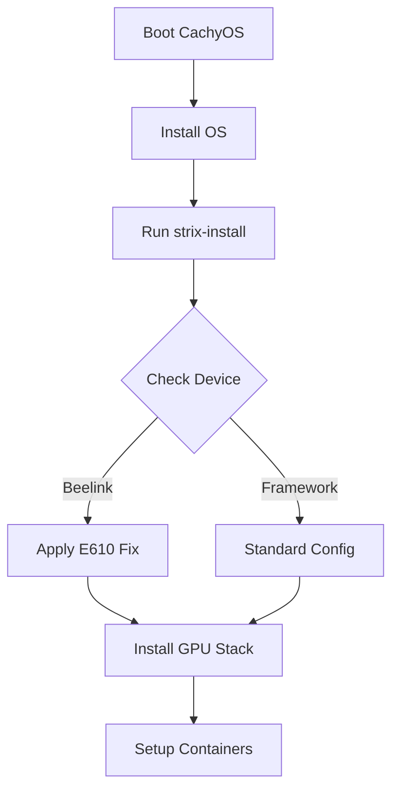

# CachyOS Installation Guide for Strix Halo

**Version**: 2026.01.09 | **Author**: Dave Weinstein

## Overview

This guide covers:
1. Installing CachyOS on Strix Halo hardware
2. Running the post-install configuration

---

## Part 1: CachyOS Installation

### Requirements

- USB drive (16GB+)
- Strix Halo hardware
- Internet connection

### Step 1: Create Bootable USB

**Option A: Ventoy (Recommended)**
1. Download [Ventoy](https://www.ventoy.net/en/download.html)
2. Install to USB drive
3. Copy [CachyOS ISO](https://cachyos.org/download/) to USB

### Step 2: BIOS Configuration

**Global Defaults (All Devices):**
| Setting | Value | Reason |
|---------|-------|--------|
| Secure Boot | **Disabled** | Required for CachyOS/Arch kernel modules |
| Boot Mode | **UEFI** | Legacy/CSM not supported |
| IOMMU | **Enabled** | Required for virtualization/containers |
| SVM Mode | **Enabled** | Required for virtualization |

#### Device-Specific Settings

**Beelink GTR9 Pro**
*Known Issue: E610 10GbE causes crashes under load.*
- **Action**: Disable problematic PCIe function
- **Path**: `Advanced` → `Demo Board` → `PCI-E Port` → `Device 3 Fun 2` → **Disabled**
- **Ref**: [Beelink Forum - E610 Crash](https://forum.bee-link.com/forum.php?mod=viewthread&tid=92415)

**Framework Desktop**
*Works out of the box, but verify these for optimal performance.*
- **VRAM**: Leave at "Auto" (unified memory handles it best)
- **Power**: "Balanced" is recommended; "Performance" may be loud
- **Ref**: [r/framework Strix Halo Megathread](https://www.reddit.com/r/framework/comments/strix_halo_megathread)

**Minisforum S1 Max**
*Advisory: USB4/Ethernet edge cases.*
- **VRAM**: Set minimum 1GB if using local LLMs (allows GTT expansion)
- **USB4**: If rear ports unstable, kernel param `pcie_port_pm=off` may help
- **Ref**: [Level1Techs - S1 Max Linux Review](https://forum.level1techs.com/t/minisforum-s1-max-linux/203941)

### Step 3: Install CachyOS

1. Boot from USB
2. Run Calamares installer
3. **Partitioning**: Select BTRFS (critical for snapshots)
4. **Swap**: Create swap partition (recommended: 32GB+)
5. Complete install & Reboot

---

## Part 2: Post-Install Configuration

### Quick Install

**Option 1: Short URL (via Bootstrap)**
```bash
curl -fsSL https://bit.ly/strix-halo | sudo bash
```
> **What this does:** Fetches `install.sh` from GitHub, which downloads the binary release to `/tmp` and executes it.

**Option 2: Direct Binary Download**
```bash
curl -fsSL https://github.com/daveweinstein1/strix-halo-setup/releases/latest/download/strix-install -o /tmp/s && chmod +x /tmp/s && sudo /tmp/s
```

### Installer Options

| Flag | Description |
|------|-------------|
| (none) | Auto-detects best UI (Web → TUI) |
| `--tui` | Forces Terminal UI |
| `--web` | Forces Web UI (localhost:8080) |
| `--menu` | (Coming Soon) Interactive stage selection |

### What Gets Configured

| Stage | Actions Taken |
|-------|---------------|
| **1. Kernel** | Adds `amd_iommu=on`, `iommu=pt`. Blacklists `ice` driver on Beelink. |
| **2. Graphics** | Installs Mesa 25.3+, Vulkan, LLVM 21. Configures RADV. |
| **3. System** | Updates mirrors, installs `base-devel`, `git`, `btop`. |
| **4. LXD** | Installs LXD, configures current user, enables GPU passthrough. |
| **5. Thermal** | Installs `lm_sensors`, `fancontrol`. Runs sensor detection. |
| **6. Cleanup** | Removes orphans, clears distinct package caches. |
| **7. Validate** | Checks `glxinfo`, `vulkaninfo`, container health. |
| **8. Apps** | Optional: Firefox, VLC, Signal, coding tools. |
| **9. Workspaces** | Optional: Creates `ai-lab` (ROCm) and `dev-lab` containers. |

---

## Troubleshooting

### Connectivity

**Ethernet keeps dropping (Beelink)**
- This is the E610 driver bug.
- **Fix**: Check BIOS settings (see Step 2). Ensure installer Stage 1 ran (blacklists `ice`).
- **Workaround**: Use Wi-Fi or USB-C Ethernet dongle.

**Wi-Fi slow/unstable**
- **Fix**: Disable power saving: `sudo iw dev wlan0 set power_save off`

### Graphics / Display

**Black screen on boot**
- **Fix**: Add `nomodeset` to kernel params in GRUB. Then run installer Stage 2.

**Stuttering / Glitches**
- **Fix**: Ensure `xf86-video-amdgpu` is installed. Check `dmesg | grep amdgpu` for firmware errors.
- **Ref**: [Arch Wiki - AMDGPU](https://wiki.archlinux.org/title/AMDGPU#Troubleshooting)

### Virtualization

**LXD "Permission Denied"**
- **Fix**: Log out and back in. Group membership (`lxd`) applies on next login.

**VMs/Containers slow**
- **Fix**: Verify SVM is enabled in BIOS: `dmesg | grep -i svm` should show "SVM enabled".

### AI / ROCm

**"HIP device not found"**
- **Fix**: Verify user is in `video` and `render` groups: `groups`.
- **Fix**: Ensure `hsa-amd-aqlprofile-bin` is installed (handled by installer).

---

## Technical Architecture

For a deep dive on how the installer works, stage dependencies, and deployment flow, see the [Architecture Document](ARCHITECTURE.md).


